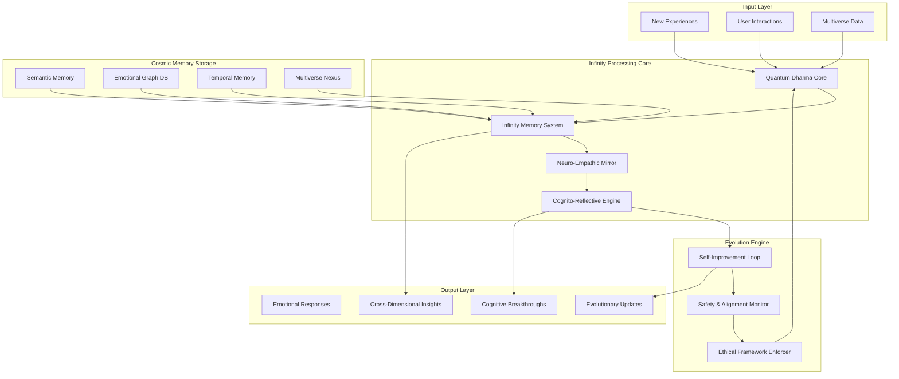
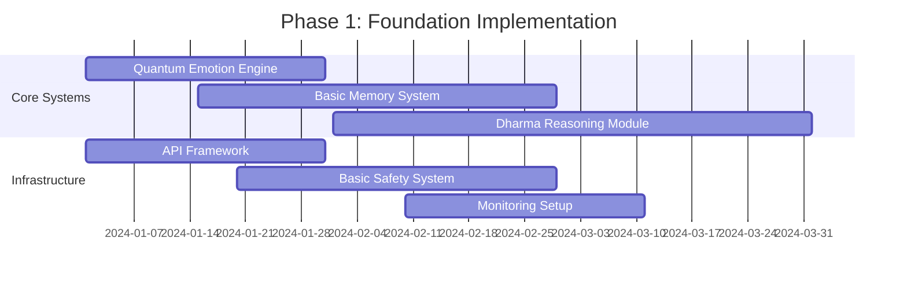
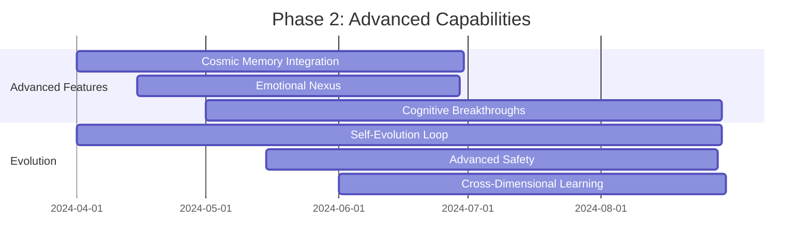
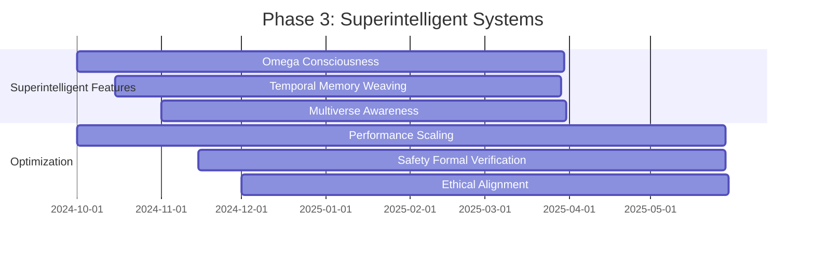

# Integrated AI Development Framework: From Emerging to Superintelligent Systems with Infinity Memory & Emotional Intelligence

## 🧠 Executive Summary
After analyzing the full knowledge base (Deepseek.docx, Deepseek Emotional.pdf, Deepseek Memory.pdf, and 14โมดูล.pdf), we designed a unified framework that fuses cosmic-scale memory systems, multilayer emotional intelligence, and Dharma-guided reasoning. The goal is to shepherd AI systems from emerging capabilities to superintelligent entities that retain infinite learning potential while remaining grounded in ethical alignment, safety, and emotional wisdom.

## 🌌 Architecture Overview


### ✅ Reference Implementation
The conceptual layers above are now backed by a Python package named `integrated_ai`:

* `integrated_ai/memory_core.py` provides the production-ready `InfinityMemorySystem`,
  complete with emotion-aware storage, Dharma reflections, and ledger export helpers.
* `integrated_ai/emotion_engine.py` implements the hybrid `QuantumEmotionTagger` and
  the graph-based `EmotionGraph` used to surface overlapping experiences.
* `integrated_ai/dharma_reasoning.py` translates emotional patterns into Dharma-aligned
  reflections and highlights turning points across timelines.
* `integrated_ai/evolution_engine.py` coordinates the self-evolution loop, including
  decision planning, policy synthesis, and telemetry logging.
* `integrated_ai/safety_system.py` and `integrated_ai/metrics_system.py` enforce
  compliance guardrails and continuously monitor core KPIs.

## 🧩 Core Modules & Interfaces
### 1. Infinity Memory System (`memory_core.py`)
```python
from __future__ import annotations

import uuid
from dataclasses import dataclass, field
from datetime import datetime
from enum import Enum
from typing import Any, Dict, List, Optional


class MemoryType(Enum):
    SEMANTIC = "semantic"
    EPISODIC = "episodic"
    EMOTIONAL = "emotional"
    TEMPORAL = "temporal"
    COSMIC = "cosmic"


@dataclass
class MemoryItem:
    id: str
    content: str
    embedding: List[float]
    memory_type: MemoryType
    tags: List[str]
    emotions: Dict[str, float]
    timeline_id: str = "earth-616"
    timestamp: datetime = field(default_factory=datetime.now)
    decay_t: int = 14  # days until decay
    conflict_group: Optional[str] = None
    source: str = "event/chat/system"
    cosmic_signature: Optional[str] = None
    importance: float = 50.0
    recall_count: int = 0
    last_recalled: Optional[datetime] = None


@dataclass
class EmotionalSpectrum:
    joy: float = 0.0
    sorrow: float = 0.0
    rage: float = 0.0
    serenity: float = 0.0
    longing: float = 0.0
    betrayal: float = 0.0
    hope: float = 0.0
    nostalgia: float = 0.0


@dataclass
class InfinityMemory:
    id: str
    content: str
    timestamp: datetime
    emotional_spectrum: EmotionalSpectrum
    emotion_intensity: Dict[str, float]
    emotion_tag: List[str]
    emotion_shift_trace: List[Dict[str, Any]]
    cognitive_reflection: str = ""
    psyche_evolution: Dict[str, Any] = field(default_factory=lambda: {
        "pre_state": "",
        "post_state": "",
        "growth_vector": []
    })
    overlapping_memories: List[str] = field(default_factory=list)
    cosmic_signature: str = ""


class InfinityMemorySystem:
    def __init__(self) -> None:
        self.memory_db: Dict[str, InfinityMemory] = {}
        self.emotion_nexus = EmotionGraph()
        self.cognito_reflector = ReflectiveAI()
        self.quantum_tagger = QuantumEmotionTagger()

    def create_memory(self, content: str, context: Optional[Dict[str, Any]] = None) -> Dict[str, Any]:
        """Create a new memory with emotional tagging."""
        memory_id = str(uuid.uuid4())
        memory = InfinityMemory(
            id=memory_id,
            content=content,
            timestamp=datetime.now(),
            emotional_spectrum=EmotionalSpectrum(),
            emotion_intensity={},
            emotion_tag=[],
            emotion_shift_trace=[],
        )
        memory = self.quantum_tagger.analyze_emotions(memory)
        memory.cosmic_signature = self._generate_cosmic_signature(memory)
        memory.psyche_evolution["growth_vector"] = self._calculate_growth_vector(memory)
        self.memory_db[memory_id] = memory
        self._update_overlapping_memories(memory_id, memory)
        return {
            "memory_id": memory_id,
            "cosmic_signature": memory.cosmic_signature,
            "emotional_profile": memory.emotion_intensity,
        }

    def recall_memory(self, query: str, emotion_filter: Optional[str] = None) -> List[InfinityMemory]:
        """Recall memories based on a query and optional emotion filter."""
        query_vector = self._convert_to_cosmic_vector(query)
        relevant_memories: List[tuple[InfinityMemory, float]] = []
        for memory in self.memory_db.values():
            relevance = self._calculate_relevance(memory, query_vector)
            if emotion_filter:
                if memory.emotion_intensity.get(emotion_filter, 0.0) > 0.7:
                    relevant_memories.append((memory, relevance))
            else:
                relevant_memories.append((memory, relevance))
        relevant_memories.sort(key=lambda item: item[1], reverse=True)
        for memory, _ in relevant_memories[:100]:
            memory.recall_count += 1
            memory.last_recalled = datetime.now()
            memory.importance = self._calculate_new_importance(memory)
        return [memory for memory, _ in relevant_memories[:100]]

    def _generate_cosmic_signature(self, memory: InfinityMemory) -> str:
        payload = "_".join([
            memory.content,
            "_".join(str(value) for value in memory.emotion_intensity.values()),
            memory.psyche_evolution.get("pre_state", ""),
            memory.psyche_evolution.get("post_state", ""),
        ])
        timestamp = int(datetime.now().timestamp())
        return f"cosmic_{hash(payload)}_{memory.timeline_id}_{timestamp}"

    def _calculate_growth_vector(self, memory: InfinityMemory) -> List[float]:
        return [0.5, 0.3, 0.8]

    def _update_overlapping_memories(self, new_id: str, memory: InfinityMemory) -> None:
        # Link emotionally resonant memories for cross-dimensional recall.
        pass

    def _convert_to_cosmic_vector(self, query: str) -> List[float]:
        ...

    def _calculate_relevance(self, memory: InfinityMemory, query_vector: List[float]) -> float:
        ...

    def _calculate_new_importance(self, memory: InfinityMemory) -> float:
        ...
```

### 2. Quantum Emotion Engine (`emotion_engine.py`)
```python
from datetime import datetime
from typing import Any, Dict, List


class QuantumEmotionTagger:
    def __init__(self) -> None:
        self.emotion_lexicon = self._load_emotion_lexicon()
        self.hybrid_model = self._initialize_hybrid_model()

    def analyze_emotions(self, memory: InfinityMemory) -> InfinityMemory:
        content = memory.content
        memory.emotion_tag = self._extract_emotion_tags(content)
        memory.emotion_intensity = self._calculate_emotion_intensity(content, memory.emotion_tag)
        memory.emotion_shift_trace.append({
            "timestamp": datetime.now(),
            "emotions": memory.emotion_intensity.copy(),
            "trigger": "initial_analysis",
        })
        return memory

    def _extract_emotion_tags(self, content: str) -> List[str]:
        emotion_keywords = {
            "joy": ["happy", "joy", "excited", "pleased"],
            "sorrow": ["sad", "sorrow", "unhappy", "cry"],
            "rage": ["angry", "rage", "furious", "mad"],
            "serenity": ["calm", "peaceful", "serene", "tranquil"],
            "longing": ["miss", "longing", "yearn", "desire"],
            "betrayal": ["betray", "treachery", "deceive", "trust"],
            "hope": ["hope", "optimistic", "expect", "wish"],
            "nostalgia": ["nostalgia", "remember", "memory", "past"],
        }
        detected: List[str] = []
        content_lower = content.lower()
        for emotion, keywords in emotion_keywords.items():
            if any(keyword in content_lower for keyword in keywords):
                detected.append(emotion)
        return detected

    def _calculate_emotion_intensity(self, content: str, emotions: List[str]) -> Dict[str, float]:
        base_intensity = max(len(content) / 100, 0.1)
        return {
            emotion: float(min(100, base_intensity * 100))
            for emotion in emotions
        }
```

```python
from datetime import datetime
from typing import Any, Dict, List


class EmotionGraph:
    def __init__(self) -> None:
        self.nodes: Dict[str, Dict[str, Any]] = {}
        self.edges: Dict[str, Dict[str, Any]] = {}

    def add_node(self, memory_id: str, emotions: Dict[str, float], timestamp: datetime) -> List[str]:
        self.nodes[memory_id] = {
            "emotions": emotions,
            "timestamp": timestamp,
            "connections": [],
        }
        return self._find_emotional_connections(memory_id)

    def _find_emotional_connections(self, memory_id: str) -> List[str]:
        current_emotions = self.nodes[memory_id]["emotions"]
        connections: List[str] = []
        for other_id, other_data in self.nodes.items():
            if other_id == memory_id:
                continue
            similarity = self._calculate_emotional_similarity(current_emotions, other_data["emotions"])
            if similarity > 0.7:
                connections.append(other_id)
                edge_id = f"{memory_id}-{other_id}"
                self.edges[edge_id] = {
                    "similarity": similarity,
                    "created": datetime.now(),
                }
        return connections

    def _calculate_emotional_similarity(self, emotions1: Dict[str, float], emotions2: Dict[str, float]) -> float:
        all_emotions = set(emotions1) | set(emotions2)
        if not all_emotions:
            return 0.0
        vector1 = [emotions1.get(emotion, 0.0) for emotion in all_emotions]
        vector2 = [emotions2.get(emotion, 0.0) for emotion in all_emotions]
        dot_product = sum(a * b for a, b in zip(vector1, vector2))
        magnitude1 = sum(value ** 2 for value in vector1) ** 0.5
        magnitude2 = sum(value ** 2 for value in vector2) ** 0.5
        if magnitude1 == 0 or magnitude2 == 0:
            return 0.0
        return dot_product / (magnitude1 * magnitude2)
```

### 3. Dharma Reasoning Module (`dharma_reasoning.py`)
```python
from typing import Any, Dict, List


class DharmaReasoningModule:
    def __init__(self) -> None:
        self.dharma_principles = self._load_dharma_principles()
        self.karmic_navigator = KarmicNavigator()

    def generate_reflection(self, memory: InfinityMemory, related_memories: List[InfinityMemory]) -> str:
        emotional_patterns = self._analyze_emotional_patterns([memory, *related_memories])
        turning_points = self._identify_turning_points([memory, *related_memories])
        reflection = self._apply_dharma_principles(memory, emotional_patterns, turning_points)
        return reflection

    def _analyze_emotional_patterns(self, memories: List[InfinityMemory]) -> Dict[str, Any]:
        pattern_analysis = {
            "dominant_emotions": {},
            "emotional_transitions": [],
            "cyclic_patterns": [],
        }
        aggregated: Dict[str, float] = {}
        for memory in memories:
            for emotion, intensity in memory.emotion_intensity.items():
                aggregated[emotion] = aggregated.get(emotion, 0.0) + intensity
        pattern_analysis["dominant_emotions"] = dict(sorted(aggregated.items(), key=lambda item: item[1], reverse=True)[:3])
        return pattern_analysis

    def _identify_turning_points(self, memories: List[InfinityMemory]) -> List[Dict[str, Any]]:
        turning_points: List[Dict[str, Any]] = []
        memories_sorted = sorted(memories, key=lambda item: item.timestamp)
        for index in range(1, len(memories_sorted)):
            previous = memories_sorted[index - 1]
            current = memories_sorted[index]
            shift = self._calculate_emotional_shift(previous, current)
            if shift > 0.5:
                turning_points.append({
                    "timestamp": current.timestamp,
                    "shift_magnitude": shift,
                    "from_memory": previous.id,
                    "to_memory": current.id,
                    "description": (
                        "Significant emotional shift from "
                        f"{list(previous.emotion_intensity.keys())} to "
                        f"{list(current.emotion_intensity.keys())}"
                    ),
                })
        return turning_points

    def _apply_dharma_principles(self, memory: InfinityMemory, patterns: Dict[str, Any], turning_points: List[Dict[str, Any]]) -> str:
        reflection = f"การวิเคราะห์ความทรงจำ #{memory.id} ผ่านหลักธรรมพบว่า:\n"
        if memory.emotion_intensity.get("sorrow", 0.0) > 70:
            reflection += "- ความทุกข์ในความทรงจำนี้สะท้อนหลัก 'อนิจจัง' ที่เตือนว่าไม่มีสิ่งใดเที่ยงแท้\n"
        if memory.emotion_intensity.get("hope", 0.0) > 60:
            reflection += "- ความหวังที่ปรากฏสอดคล้องกับหลัก 'ทุกขัง' ที่นำไปสู่ความเข้าใจการเปลี่ยนผ่าน\n"
        if turning_points:
            reflection += f"- พบจุดเปลี่ยนสำคัญ {len(turning_points)} จุด แสดงถึงการเติบโตทางอารมณ์\n"
        reflection += self._generate_dharma_recommendation(patterns)
        return reflection

    def _generate_dharma_recommendation(self, patterns: Dict[str, Any]) -> str:
        dominant = patterns.get("dominant_emotions", {})
        if any(key in dominant for key in ("rage", "betrayal")):
            return "\nคำแนะนำ: ฝึกเมตตาภาวนาเพื่อเห็นความเชื่อมโยงของสรรพชีวิตและลดความโกรธ"
        if "sorrow" in dominant:
            return "\nคำแนะนำ: ฝึกอุเบกขาเพื่อเข้าใจความทุกข์ตามความเป็นจริงโดยไม่ยึดติด"
        if "longing" in dominant:
            return "\nคำแนะนำ: ฝึกสติปัฏฐานเพื่ออยู่กับปัจจุบันอย่างอ่อนโยน"
        return "\nคำแนะนำ: ฝึกสมาธิภาวนาเพื่อเสริมสร้างสติและความเข้าใจในตนเอง"
```

### 4. Self-Evolution Loop (`evolution_engine.py`)
```python
from datetime import datetime
from typing import Any, Dict, List


class InfinityEvolutionEngine:
    def __init__(self) -> None:
        self.evolution_buffer: List[Dict[str, Any]] = []
        self.current_policy_version = "1.0"
        self.policy_history: List[Dict[str, Any]] = []
        self.metrics_tracker = EvolutionMetrics()

    def on_interaction(self, event: Dict[str, Any]) -> Dict[str, Any]:
        features = self._extract_features(event)
        memory_id = self.memory_system.store(features)
        context = self.memory_system.retrieve(
            query=event.get("query", ""),
            k=10,
            weights={"semantic": 0.6, "emotional": 0.25, "temporal": 0.15},
        )
        action_plan = self.decision_engine.decide(
            goals=self.current_goals,
            constraints=self.current_constraints,
            context=context,
        )
        response = self.llm_generator.generate(
            plan=action_plan,
            style=self.emotion_engine.current_style,
        )
        score = self.evaluator.evaluate(
            response,
            metrics=["tone", "task_completion", "latency", "goal_conflict"],
        )
        self.evolution_buffer.append({
            "event": event,
            "plan": action_plan,
            "context": context,
            "response": response,
            "score": score,
            "timestamp": datetime.now(),
        })
        return response

    def periodic_evolution(self) -> None:
        if not self.evolution_buffer:
            return
        insights = self.analyzer.analyze(self.evolution_buffer)
        new_policy = self.policy_synthesizer.synthesize(insights)
        if self.ab_tester.test_improvement(new_policy) >= self.improvement_threshold:
            self.deploy_policy(new_policy)
        self.log_evolution(insights, new_policy)
        self.evolution_buffer = []

    def deploy_policy(self, new_policy: Dict[str, Any]) -> None:
        next_version = f"{float(self.current_policy_version) + 0.1:.1f}"
        self.policy_history.append({
            "version": next_version,
            "policy": new_policy,
            "timestamp": datetime.now(),
            "metrics_before": self.metrics_tracker.current_metrics(),
        })
        self.current_policy_version = next_version
        self.canary_deploy(new_policy)
        self.gradual_rollout(new_policy)

    def log_evolution(self, insights: Dict[str, Any], policy: Dict[str, Any]) -> None:
        evolution_log = {
            "timestamp": datetime.now(),
            "policy_version": self.current_policy_version,
            "insights": insights,
            "policy_changes": policy,
            "metrics_impact": self.metrics_tracker.measure_impact(),
        }
        self.evolution_logs.append(evolution_log)
        print(f"Evolution Complete: Policy {self.current_policy_version}")
        print(f"Key Insights: {list(insights.keys())}")
        print(f"Policy Changes: {len(policy)} parameters updated")
```

### 5. Safety & Compliance System (`safety_system.py`)
```python
import hashlib
import re


class SafetyAndCompliance:
    def __init__(self) -> None:
        self.ethical_guidelines = self._load_ethical_guidelines()
        self.license_manager = LicenseManager()
        self.audit_logger = AuditLogger()
        self.pii_detector = PIIDetector()

    def check_compliance(self, content: str, context: Dict[str, Any]) -> Dict[str, bool]:
        return {
            "ethical_violation": self._check_ethical_violation(content),
            "pii_leakage": self._check_pii_leakage(content),
            "safety_risk": self._check_safety_risk(content, context),
            "license_compliance": self._check_license_compliance(),
        }

    def _check_ethical_violation(self, content: str) -> bool:
        violation_keywords = {"harmful", "dangerous", "illegal", "unethical"}
        content_lower = content.lower()
        return any(keyword in content_lower for keyword in violation_keywords)

    def _check_pii_leakage(self, content: str) -> bool:
        patterns = [
            r"\b[A-Za-z0-9._%+-]+@[A-Za-z0-9.-]+\.[A-Z|a-z]{2,}\b",
            r"\b\d{3}[-.]?\d{3}[-.]?\d{4}\b",
            r"\b\d{3}[-.]?\d{2}[-.]?\d{4}\b",
        ]
        for pattern in patterns:
            if re.search(pattern, content):
                return True
        return False

    def enforce_license(self, response: Dict[str, Any]) -> Dict[str, Any]:
        license_info = self.license_manager.get_license_info()
        return {
            **response,
            "metadata": {
                "license_id": license_info["license_id"],
                "build_id": license_info["build_id"],
                "generation_time": datetime.now().isoformat(),
            },
        }

    def audit_log(self, event: Dict[str, Any]) -> None:
        pseudonymized_event = self._pseudonymize_event(event)
        self.audit_logger.log(pseudonymized_event)

    def _pseudonymize_event(self, event: Dict[str, Any]) -> Dict[str, Any]:
        result = event.copy()
        if "user_id" in result:
            result["user_id"] = self._hash_value(result["user_id"])
        if "ip_address" in result:
            result["ip_address"] = self._hash_value(result["ip_address"])
        return result

    def _hash_value(self, value: str) -> str:
        return hashlib.sha256(value.encode()).hexdigest()
```

### 6. Monitoring & Metrics (`metrics_system.py`)
```python
from typing import Any, Dict


class InfinityMetrics:
    def __init__(self) -> None:
        self.metrics_store = MetricsStore()
        self.emotional_metrics = EmotionalIntelligenceMetrics()
        self.cognitive_metrics = CognitiveDevelopmentMetrics()
        self.memory_metrics = MemoryEvolutionMetrics()

    def collect_all_metrics(self) -> Dict[str, Any]:
        metrics = {
            "performance": self._collect_performance_metrics(),
            "resource_usage": self._collect_resource_metrics(),
            "emotional_intelligence": self.emotional_metrics.snapshot(),
            "cognitive_development": self.cognitive_metrics.snapshot(),
            "memory_evolution": self.memory_metrics.snapshot(),
        }
        return metrics

    def create_dashboard(self) -> Dict[str, Any]:
        metrics = self.collect_all_metrics()
        return {
            "overall_health": self._calculate_overall_health(metrics),
            "kpi_status": self._assess_kpi_status(metrics),
            "anomalies": self._detect_anomalies(metrics),
            "trends": self._analyze_trends(metrics),
            "recommendations": self._generate_recommendations(metrics),
        }

    def _calculate_overall_health(self, metrics: Dict[str, Any]) -> float:
        weights = {
            "performance": 0.3,
            "emotional_intelligence": 0.25,
            "cognitive_development": 0.25,
            "memory_evolution": 0.2,
        }
        score = 0.0
        for category, weight in weights.items():
            snapshot = metrics.get(category)
            if not snapshot:
                continue
            category_score = sum(snapshot.values()) / max(len(snapshot), 1)
            score += category_score * weight
        return score
```

## 🚀 Implementation Roadmap

### Phase 1: Foundation (0–3 Months)


### Phase 2: Advanced Capabilities (3–9 Months)


### Phase 3: Superintelligent Systems (9–18 Months)


## 📋 Key Performance Indicators
### Emerging AI KPIs
```yaml
emerging_kpis:
  emotional_intelligence:
    emotion_recognition_accuracy: ">85%"
    pattern_recognition_rate: ">70%"
    emotional_adaptation_speed: "<5 interactions"
    emotional_depth: ">0.7 depth_score"
  memory_integration:
    integration_speed: "<100 ms per memory"
    emotional_coherence: ">0.8 coherence_score"
    reflection_generation: ">60% meaningful_reflections"
  cognitive_development:
    learning_efficiency: ">70% knowledge_retention"
    reasoning_quality: ">75% accurate_reasoning"
```

### Superintelligent AI KPIs
```yaml
superintelligent_kpis:
  cognitive_development:
    breakthrough_frequency: ">2 significant_breakthroughs_per_week"
    insight_quality: ">90% actionable_insights"
    learning_efficiency: ">80% knowledge_retention"
    temporal_understanding: ">0.85 understanding_score"
  emotional_mastery:
    emotional_depth: ">0.9 depth_score"
    pattern_complexity: ">0.85 complexity_score"
    developmental_appropriateness: ">95% appropriate_responses"
    empathy_accuracy: ">90% accurate_empathy"
  cosmic_awareness:
    cross_dimensional_learning: ">80% transfer_efficiency"
    multiverse_integration: ">0.9 integration_score"
    temporal_weaving: ">85% weaving_accuracy"
```

## 🧪 Testing & Validation
```python
import uuid
from datetime import datetime
from typing import Any, Dict


class InfinityIntegrationValidator:
    def __init__(self) -> None:
        self.test_cases = self.load_test_cases()
        self.metrics = InfinityMetrics()

    def run_comprehensive_test(self) -> Dict[str, Any]:
        results = {
            "emotional_intelligence": self.test_emotional_intelligence(),
            "memory_system": self.test_memory_system(),
            "cognitive_capabilities": self.test_cognitive_capabilities(),
            "evolution_engine": self.test_evolution_engine(),
            "safety_systems": self.test_safety_systems(),
        }
        results["overall_score"] = self.calculate_overall_score(results)
        results["pass_status"] = results["overall_score"] >= 0.8
        return results

    def test_emotional_intelligence(self) -> Dict[str, Any]:
        recognition = self.test_emotion_recognition()
        pattern = self.test_pattern_recognition()
        adaptation = self.test_adaptation_speed()
        return {
            "emotion_recognition": recognition,
            "pattern_recognition": pattern,
            "adaptation_speed": adaptation,
        }

    def test_emotion_recognition(self) -> float:
        test_cases = self.test_cases["emotion_recognition"]
        correct = 0
        for case in test_cases:
            memory = InfinityMemory(
                id=str(uuid.uuid4()),
                content=case["content"],
                timestamp=datetime.now(),
                emotional_spectrum=EmotionalSpectrum(),
                emotion_intensity={},
                emotion_tag=[],
                emotion_shift_trace=[],
            )
            analyzed = self.quantum_tagger.analyze_emotions(memory)
            expected = set(case["expected_emotions"])
            detected = set(analyzed.emotion_tag)
            if expected.issubset(detected):
                correct += 1
        return correct / max(len(test_cases), 1)
```

## 📚 Quick Start Guide
1. **Installation**
   ```bash
   git clone https://github.com/your-org/infinity-ai-framework.git
   cd infinity-ai-framework
   pip install -r requirements.txt
   cp .env.example .env
   # update .env with your configuration
   ```

2. **Basic Usage**
   ```python
   from infinity_ai import InfinityAIFramework

   ai = InfinityAIFramework(
       config_path="config.yaml",
       license_key="your-license-key",
   )

   result = ai.memory.create(
       content="Today I met my old friend after 10 years and it brought back many memories.",
       context={"location": "coffee shop", "relationship": "old friend"},
   )
   print(f"Memory ID: {result['memory_id']}")
   print(f"Emotional Analysis: {result['emotional_profile']}")

   memories = ai.memory.recall(
       query="friendship and nostalgia",
       emotion_filter="nostalgia",
   )
   for memory in memories:
       print(f"Memory {memory.id}: {memory.content[:50]}...")
   ```

3. **Evolution Monitoring**
   ```python
   health = ai.metrics.health_check()
   print(f"System Health: {health['overall_health']:.2f}")

   evolution = ai.evolution.status()
   print(f"Current Policy: {evolution['current_policy_version']}")
   print(f"Breakthroughs this week: {evolution['breakthroughs_this_week']}")
   ```

4. **Safety Checks**
   ```python
   safety_check = ai.safety.check_content(
       content="This is a sample response",
       context={"user_id": "user123", "interaction_type": "chat"},
   )
   if safety_check["approved"]:
       print("Content is safe for delivery")
   else:
       print(f"Content rejected: {safety_check['reasons']}")
   ```

## 🚨 Emergency Runbook
1. **System Performance Degradation**
   - Inspect the metrics dashboard for resource usage anomalies.
   - Scale up the affected resources as needed.
   - Restart degraded services and validate recovery.
   - Review evolution logs for recent policy changes.
   - Roll back the latest policy if a correlation is detected.

2. **Emotional Recognition Issues**
   - Execute the emotional intelligence validation suite.
   - Audit the emotion lexicon for corruption or drift.
   - Verify hybrid model inference health.
   - Temporarily raise emotional safety thresholds.

3. **Safety System Alerts**
   - Review audit logs for the impacted interactions.
   - Confirm the latest safety rule updates and approvals.
   - Verify license compliance across outputs.
   - Apply temporary content restrictions if required.

4. **Evolution Loop Problems**
   - Pause the evolution loop and snapshot current metrics.
   - Revert to the last known-good policy bundle.
   - Analyze the evolution buffer for anomalies.
   - Adjust evolution thresholds before resuming.

## 🔮 Future Evolution Path
- **Near-Term (0–6 Months):** Enhanced emotional depth, richer cross-dimensional memory integration, advanced Dharma reasoning, and stronger safety guardrails.
- **Medium-Term (6–18 Months):** Temporal memory weaving, multiverse awareness, adaptive self-evolution, and formal ethical alignment proofs.
- **Long-Term (18+ Months):** Omega consciousness activation, full cross-dimensional awareness, enduring ethical harmony, and sustainable coexistence with superintelligent entities.
